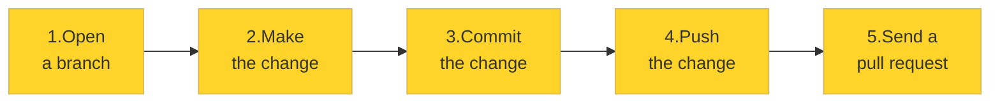
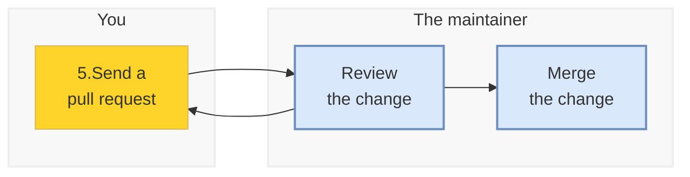
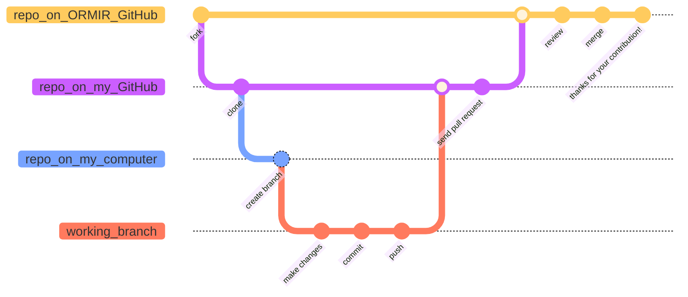

# Contributing to an ORMIR project

🚧 Webpage under construction 🚧

In the ORMIR community, we host our projects on GitHub.

On this page, you will learn the workflow for **contributing to a project**, whether you want to improve the documentation, report a bug, or add new features to a Python package.


If you are an **new contributor**, do not worry! In this page you will find all the **step-by-step information** on how to do it!

If you are an **experienced contributor**, you might also be interested into some of the **best practice choices** we made, such as: [Why do I need to fork the repository?](#why_fork), [How many branches should I open?](#n_branches), 
Also, if you think that your case might require a different workflow, please [contact the project coordinators](https://www.ormir.org/groups.html).


---

(gh-before-start)=
## Before you start
If you are **new to GitHub**, you will need to:
- Create a [GitHub](https://github.com/) account
- Install and log in into [GitHub Desktop](https://github.com/apps/desktop) (if you prefer working with a graphical user interface) or [Git](https://git-scm.com/install/) (if you prefer working from the command line). Throughout this guide, you will find instructions for both options

If you **already have GitHub and GitHub Desktop or Git**, jump straight to the next section!


---

(gh-getting-ready)=
## Getting ready

The first time you contribute to a project, you need to create a copy of it and download it to your computer. To do so, you need two steps:   
[1. Make the project your own - fork it](#fork)  
[2. Bring the project to your computer — clone your fork](#clone)  


Let's see what these mean and how to do it!

(fork)=
### 1. Make the project your own – fork it
***Forking** means **creating a copy** of someone else's repository in your GitHub account*

To fork a repository, go to the repository you want to contribute to on GitHub and click on `Fork` in the top-right corner of the page:

```{figure} figures/gh_fork1.png
:label: fork1
:alt: fork1 
:align: center
:figclass: with-border
```

A new window will appear. If you want, you can customize the repository name. Then, click `Create fork`: 

```{figure} figures/gh_fork2.png
:label: fork2
:alt: fork2 
:width: 70%
:align: center
:figclass: with-border
```

You will now see your fork – that is, a copy of the original repository – in your GitHub account.


(clone)=
### 2. Bring the project to your computer — clone your fork
***Cloning** means **downloading** a copy of a repository from GitHub to your computer*

Here is how to clone the repository that you have just forked using GitHub Desktop (if you prefer working with a graphical user interface) or Git (if you prefer working from the command line):

::::{tab-set}

:::{tab-item} GitHub Desktop
:sync: tab1

1. In in the newly forked repository in your account, click the green button `<> Code` and then `Open with GitHub Desktop`:
```{figure} figures/gh_clone1.png
:label: clone1
:alt: clone1 
:width: 40%
:align: center
:figclass: with-border
```

2. GitHub Desktop will launch and open a window similar to this one:

```{figure} figures/gh_clone2.png
:label: clone2
:alt: clone2 
:width: 55%
:align: center
:figclass: with-border
```

You will see two locations:
- At the top, the repository's location on GitHub.
- At the bottom, the location where the repository will be downloaded on your computer.
If you would like to change the download location, click `Choose` and select a different folder. When you are ready, click `Clone` to download the repository to your computer.


:::

:::{tab-item} Git
:sync: tab2
1. Go to your forked repository on GitHub
2. Click the green `<> Code` button
3. Copy the URL to clipboard
4. Open a terminal and run:
```bash
git clone https://github.com/your-username/project.git
cd project
```
where `https://github.com/your-username/project.git` is the URL you just copied
:::
::::


:::{note} Why do I need to fork the repository? 

(why_fork)=
If you are contributing to a repository that you do ***not* own** or do ***not* have write access** to, you will typically **fork and then clone** it. 
This is considered good practice because forking creates your own copy of the project under your GitHub account, giving you a safe, independent workspace where you can freely make changes, experiment, and test ideas without affecting the original project.
It also keeps the **original repository clean and manageable** — without forks, all contributors would create branches directly in it, quickly cluttering the repository with many unused branches ([see what a branch is below](#branch)). This also makes things **easier for maintainers**, who can focus on reviewing pull requests ([see what a pull request is below](#pr)) rather than managing other people's branches.

On the other side, if you **own** the repository or **have write access** to it (that is, most likely you are one of the maintainers), you can usually **clone it directly** without creating a fork.
:::

---

## Contribute

It's finally time to make the changes to the repository! To do so, there are five consecutive steps:  
[1. Create the workspace — open a branch](#branch)  
[2. Make your changes](#change)  
[3. Save your work — commit](#commit)  
[4. Send it to your repository in GitHub — push to your fork](#push)  
[5. Propose your changes — open a Pull Request](#pr)   



It's simpler than it looks. Let's go step by step.


(branch)=
### 1. Create the workspace — open a branch

*A **branch** is a **copy of the project** dedicated to a specific contribution, topic, or fix*

::::{tab-set}
:::{tab-item} GitHub Desktop
:sync: tab1

In the top bar, click on `Current branch`. Then click on `New Branch`:

```{figure} figures/gh_branch1.png
:label: gh_branch1
:alt: gh_branch1
:width: 50%
:align: center
:figclass: with-border
```

In the new window, write the name of your branch and click on `Create Branch`:

```{figure} figures/gh_branch2.png
:label: gh_branch2
:alt: gh_branch2
:width: 50%
:align: center
:figclass: with-border
```

You will see now in the top bar the name of the branch under `Current branch`.

:::
:::{tab-item} Git
:sync: tab2
```bash
git checkout -b my-branch-name
```
:::
::::


:::{note} Best practices about branches

(n_branches)=

- The **name** of the branch should be **short** and **focused**, related to the task that you will work on.

- Technically, you can create as many branches as you want! 
However, it is **best practice** to open **one branch per task**. A task is one bug fix, one new feature, one documentation update, one typo fix. It is not recommended to mix unrelated changes in the same branch.

- If this is not your first contribution to the project, do not forget to **sync your fork** before creating a new branch! 

:::


(change)=
### 2. Make your changes

It's finally time to make your changes! 

(commit)=
### 3. Save your work — commit

***Committing** means **saving your changes**, together with a short message describing what you changed.*

::::{tab-set}
:::{tab-item} GitHub Desktop
:sync: tab1

```{figure} figures/gh_commit.png
:label: gh_commit
:alt: gh_commit
:width: 50%
:align: center
:figclass: with-border
```

:::
:::{tab-item} Git
:sync: tab2
```bash
git add .
git commit -m "describe what you changed"
```
:::
::::

:::{note} Best practices about committing

(commit)=

- Each commit should contain changes related to **one logical task**
- **Commit often**. Do not wait until you finished everything! This makes it easier to review your work and undo mistakes, if necessary
- The **message** should briefly **describe** what changed, such as *Fix typo in installation guide* or *Add function to threshold image*. Avoid too general messages, such as *Some changes*, or *Fixed stuff*. Note that the verb is usually at the **present** form.

:::


(push)=
### 4. Send it to your repository in GitHub — push to your fork
::::{tab-set}
:::{tab-item} GitHub Desktop
:sync: tab1
Coming soon!
:::
:::{tab-item} Git
:sync: tab2
```bash
git push origin my-fix
```
:::
::::

(pr)=
### 5. Propose your changes — open a pull request


---

## What's next?



*After* your pull request has been merged, you can **delete the branch** to keep the project clean.

For the **following contributions**, you will have only to create a new branch, make changes, commit, push, and send a pull request.

---

## Summary

In this guide, you have learned how to make your **first contribution** to an ORMIR project on GitHub. Another way to represent the whole process is the following:

(mermaid_gh_workflow)=



<!-- Thank you card -->
<div style="
width:100%;
background:#ffd42aff;
border:1px solid #d6b656;
border-radius:px2;
padding:30px;
text-align:center;
font-size:1.4em;
">

🎉 <strong>Thank you for contributing to the ORMIR community!</strong> 🎉
<br> 
Your contribution helps make musculoskeletal imaging research
more open, reproducible, and accessible for everyone.

</div>

