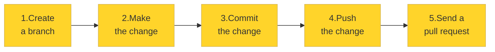
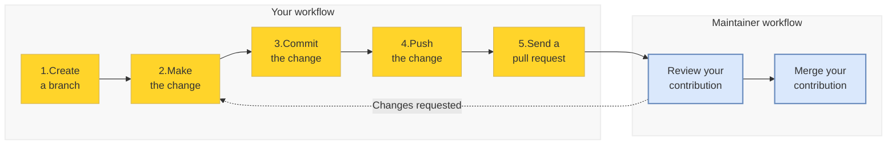

# Contributing to an ORMIR project

In the ORMIR community, we host our projects on GitHub.

On this page, you will learn the workflow for **contributing to a project**, whether you want to improve the documentation, report a bug, or add new features to a Python package.


If you are a **new contributor**, don't worry! This guide walks you through the entire process **step by step**, from setting up the project on your computer to opening your first pull request.

If you are an **experienced contributor**, you may also be interested in some of the **best practices** we follow, such as: 
[Why do I need to fork the repository?](#why_fork), 
[How may branches should I create?](#n_branches), and
[How often should I commit?](#n_commits). 
Also, if you think that your contribution requires a different workflow, please [contact the project coordinators](https://www.ormir.org/groups.html).

---

(gh-before-start)=
## Before you start
If you are **new to GitHub**, you will need to:
- Create a [GitHub](https://github.com/) account
- Install and log in into [GitHub Desktop](https://github.com/apps/desktop) (if you prefer working with a graphical user interface) or [Git](https://git-scm.com/install/) (if you prefer working from the command line). Throughout this guide, you will find instructions for both options

If you **already have GitHub and GitHub Desktop or Git**, jump straight to the next section!


---

(gh-getting-ready)=
## Getting ready

The first time you contribute to a project, you need to create a copy of it and download it to your computer. To do so, you need two steps:   
[1. Make the project your own - fork it](#fork)  
[2. Bring the project to your computer — clone your fork](#clone)  


Let's see what these mean and how to do it!

---

(fork)=
### 1. Make the project your own – fork it
***Forking** means **creating a copy** of someone else's repository in your GitHub account*

To fork a repository, go to the repository you want to contribute to on GitHub and click on `Fork` in the top-right corner of the page:

```{figure} figures/gh_fork1.png
:label: fork1
:alt: fork1 
:align: center
:figclass: with-border
```

A new window will appear. If you want, you can customize the repository name. Then, click `Create fork`: 

```{figure} figures/gh_fork2.png
:label: fork2
:alt: fork2 
:width: 70%
:align: center
:figclass: with-border
```

You will now see your fork – that is, a copy of the original repository – in your GitHub account.

---

(clone)=
### 2. Bring the project to your computer — clone your fork
***Cloning** means **downloading** a copy of a repository from GitHub to your computer*

Here is how to clone the repository that you have just forked using GitHub Desktop (if you prefer working with a graphical user interface) or Git (if you prefer working from the command line):

::::{tab-set}

:::{tab-item} GitHub Desktop
:sync: tab1

In in the newly forked repository in your account, click the green button `<> Code` and then `Open with GitHub Desktop`:
```{figure} figures/gh_clone1.png
:label: clone1
:alt: clone1 
:width: 40%
:align: center
:figclass: with-border
```

GitHub Desktop will launch and open a window similar to this one:

```{figure} figures/gh_clone2.png
:label: clone2
:alt: clone2 
:width: 55%
:align: center
:figclass: with-border
```

You will see two locations:
- At the top, the repository's location on GitHub.
- At the bottom, the location where the repository will be downloaded on your computer.
If you would like to change the download location, click `Choose` and select a different folder. When you are ready, click `Clone` to download the repository to your computer.
:::

:::{tab-item} Git
:sync: tab2
1. Go to your forked repository on GitHub
2. Click the green `<> Code` button
3. Copy the URL to clipboard
4. Open a terminal and run:
```bash
git clone https://github.com/your-username/project.git
cd project
```
where `https://github.com/your-username/project.git` is the URL you just copied
:::
::::


:::{note} Why do I need to fork the repository? 
:class:dropdown

(why_fork)=
If you are contributing to a repository that you do ***not* own** or do ***not* have write access** to, you will typically **fork and then clone** it. 
This is considered good practice because forking creates your own copy of the project under your GitHub account, giving you a safe, independent workspace where you can freely make changes, experiment, and test ideas without affecting the original project.
It also keeps the **original repository clean and manageable** — without forks, all contributors would create branches directly in it, quickly cluttering the repository with many unused branches (see what a [branch](#branch) is below). This also makes things **easier for maintainers**, who can focus on reviewing pull requests (see what a [pull request](#pr) is below) rather than managing other people's branches.

On the other side, if you **own** the repository or **have write access** to it (that is, most likely you are one of the maintainers), you can usually **clone it directly** without creating a fork. 
:::

---

## Contribute

It's finally time to make the changes to the repository! To do so, there are five consecutive steps:  
[1. Setup the workspace — create a branch](#branch)  
[2. Make your changes](#change)  
[3. Save your work — commit](#commit)  
[4. Send it to your repository in GitHub — push to your fork](#push)  
[5. Propose your changes — open a pull request](#pr)   



It's simpler than it looks. Let's go step by step.

---

(branch)=
### 1. Setup the workspace — create a branch

*A **branch** is a **copy of the project** dedicated to a specific contribution, topic, or fix*

(sync)=
Before creating a new branch, you have to make sure that your **fork** is **up to date** with the original repository. 
This ensures that your branch starts from the latest version of the project and helps avoid merge conflicts later on.
If this is your **first contribution** and you have just forked and cloned the repository, you can skip this step because your fork is **already synchronized** with the original repository and you can proceed directly to [creating your branch](#create-branch).

::::{tab-set}
:::{tab-item} GitHub Desktop
:sync: tab1

Go to your fork on the GitHub website and click `Sync fork`:
```{figure} figures/gh_sync_fork.png
:label: gh_sync_fork
:alt: gh_sync_fork
:width: 100%
:align: center
:figclass: with-border
```
:::
:::{tab-item} Git
:sync: tab2

```bash
git checkout main
git fetch upstream
git merge upstream/main
git push origin main
```
:::
::::

(create-branch)=
Let's **create a new branch**!

::::{tab-set}
:::{tab-item} GitHub Desktop
:sync: tab1

Click `Current branch` in the top toolbar, then select `New Branch`:

```{figure} figures/gh_branch1.png
:label: gh_branch1
:alt: gh_branch1
:width: 50%
:align: center
:figclass: with-border
```

In the dialog that opens, enter a **short, descriptive name** for your branch that reflects the task you are working on.
For example, *add-contributing-guide* or *improve-unit-tests* clearly indicate the purpose of the branch. 
Avoid generic names such as *changes* or *branch1*, which do not convey what the branch is intended for.

Click `Create Branch`:

```{figure} figures/gh_branch2.png
:label: gh_branch2
:alt: gh_branch2
:width: 50%
:align: center
:figclass: with-border
```

The name of the branch will appear under `Current Branch` in the top toolbar, indicating that it is now your active working branch.

:::
:::{tab-item} Git
:sync: tab2
```bash
git checkout -b my-branch-name
```
:::
::::


:::{note} How may branches should I create? 
:class:dropdown
(n_branches)=

Technically, you can create as many branches as you want! 
However, **best practice** is to open **one branch per task**. A task is one bug fix, one new feature, one documentation update, one typo fix. It is not recommended to mix unrelated changes in the same branch.
:::

---

(change)=
### 2. Make your changes

It's finally time to make your changes! Open the project in your favorite editor, such as Visual Studio Code or JupyterLab, and edit existing files or add new ones.

---

(commit)=
### 3. Save your work — commit

***Committing** means **saving your changes** at a specific moment in time on your computer*

::::{tab-set}
:::{tab-item} GitHub Desktop
:sync: tab1

In the left panel, you will see all the files that have been modified. Review the list and decide which changes you want to include in the commit by selecting or deselecting individual files. If you want that a file will never be tracked (for example, temporary files), right-click on it and select `Add to .gitignore`.

  
```{figure} figures/gh_gitignore.png
:label: gh_gitignore
:alt: gh_gitignore
:width: 50%
:align: center
:figclass: with-border
```

Next, write a **commit message**. The message should briefly describe the changes you are saving, for example, *Fix typo in installation guide* or *Add function to threshold image*. Avoid vague messages such as *Some changes* or *Fixed stuff*, as they do not explain what you actually modified. By convention, commit messages start with a verb in the **present (imperative) form**, such as *Fix*, *Add*, *Update*, or *Improve*.

If needed, you can also add a longer **description** to provide additional context about the changes.

```{figure} figures/gh_commit.png
:label: gh_commit
:alt: gh_commit
:width: 50%
:align: center
:figclass: with-border
```

Press the button to commit your files.
:::

:::{tab-item} Git
:sync: tab2
```bash
git add .
git commit -m "describe what you changed"
```
:::
::::

:::{note} How often should I commit?
:class:dropdown
(n_commits)=

- Each commit should contain changes related to **one logical task**
- **Commit often**. Do not wait until you finished everything! This makes it easier to review your work and undo mistakes, if necessary
:::

---

(push)=
### 4. Send it to your repository in GitHub — push to your fork

*A **push** **sends the commits** you have made on your computer **to the remote repository on GitHub**, making them available to others*

::::{tab-set}
:::{tab-item} GitHub Desktop
:sync: tab1

To push your commits, simply click `Push origin` in the top toolbar or in the central panel:

```{figure} figures/gh_push.png
:label: gh_push
:alt: gh_push
:width: 60%
:align: center
:figclass: with-border
```

:::

:::{tab-item} Git
:sync: tab2
```bash
git push origin my-fix
```
:::
::::


---

(pr)=
### 5. Propose your changes — open a pull request

*A **pull request (PR)** is how you **ask the maintainers** of a project **to review and add your changes** to the project*

Go to your fork on **GitHub.com** and click `Compare & pull request`.  

```{figure} figures/gh_pr1.png
:label: gh_pr1
:alt: gh_pr1
:width: 60%
:align: center
:figclass: with-border
```
Add a **title** that briefly summarizes your contribution and a **description** explaining what you changed and why. When you are ready, click `Create pull request`:

```{figure} figures/gh_pr2.png
:label: gh_pr2
:alt: gh_pr2
:width: 60%
:align: center
:figclass: with-border
```

---

## What's next?

(collab)=
###  1. Collaborate with the maintainer
The maintainers (typically the [project coordinator](https://www.ormir.org/groups.html)) will receive a notification of your pull requests and **review your contribution**. 
If necessary, they may ask you to provide further clarification or make additional changes.
If so, simply make the requested changes in the **same branch**, commit them, and push them to GitHub. The pull request will update automatically.
Once the review is complete, the maintainers will **merge your contribution** into the project.




###  2. Get ready your next contribution!

After your pull request has been merged, you *can* **delete the branch** to keep the project clean.

When you are ready to **contribute again**, remember to [sync your fork](#sync) with the original repository before creating a new branch. 
Then, simply follow the same workflow:
[create a new branch](#branch), [make your changes](#change), [commit](#commit), [push](#push), [open a pull request](#pr), and [collaborate with the maintainer](#collab)!


<!-- Thank you card -->
<div style="
width:100%;
background:#ffd42aff;
border:1px solid #d6b656;
border-radius:px2;
padding:30px;
text-align:center;
font-size:1.4em;
">

🎉 <strong>Thank you for contributing to the ORMIR community!</strong> 🎉
<br> 
Your contribution helps make musculoskeletal imaging research
more open, reproducible, and accessible for everyone.

</div>

